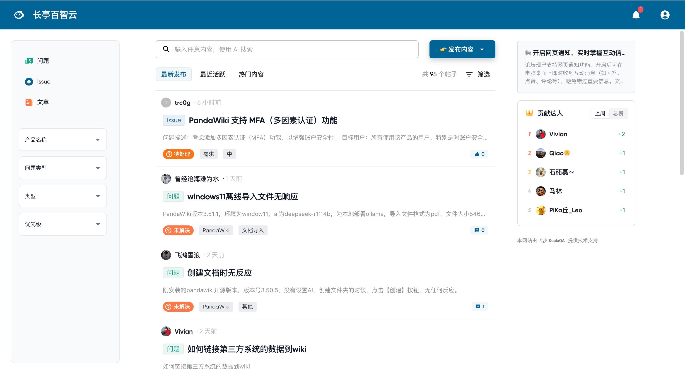
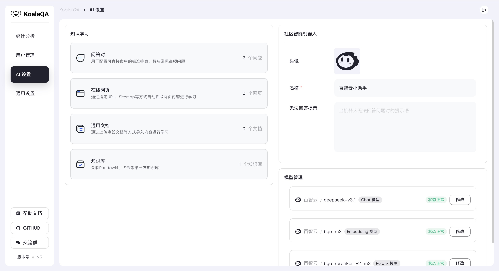
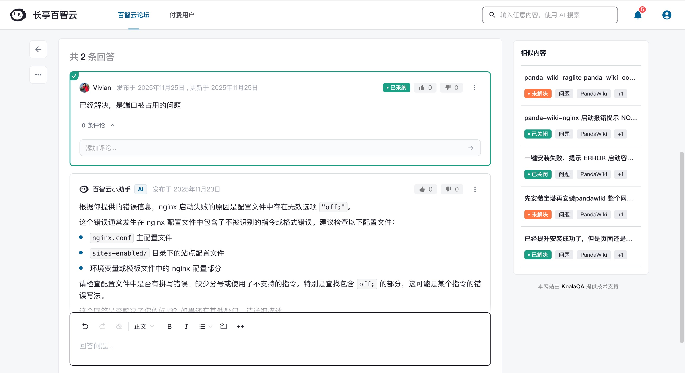
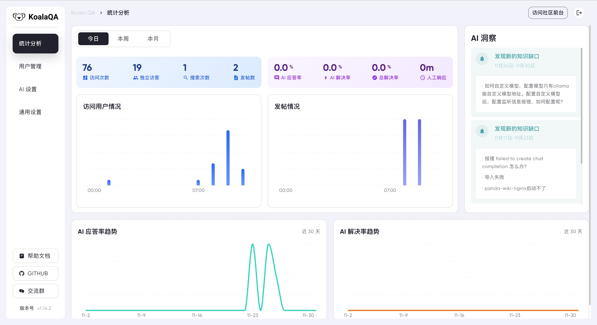

<h1 align="center">KoalaQA</h1>

<p align="center">
  
  
  
  
</p>


<p align="center">
  <a target="_blank" href="https://koalaqa.docs.baizhi.cloud/welcome">📖 产品文档</a> &nbsp; | &nbsp;
  <a target="_blank" href="https://bbs.baizhi.cloud/">🚀 问答论坛</a>
</p>

## 👋 项目介绍
**KoalaQA** 是一款 AI 大模型驱动的开源智能售后服务产品，提供 **AI 客服、AI 洞察、AI 搜索、AI 运营**等能力，帮助你快速搭建**企业内外部问答平台、开发者社区、用户服务社区**，帮助团队显著降低人工运营成本、提升客户满意度与响应效率，助力实现 ZCR（Zero Contact Resolution, 零人工介入解决）目标。

## 🌟 界面展示

|  KoalaQA 前台         |   后台管理             |
| ------------------------------------------ | ------------------------------------------ |
|  |  |
|  |  |

## 🔥 功能与特色
- **AI 智能客服全天侯实时应答**：理解客户意图、自然回答问题，自动处理约 90% 的常见问题，复杂问题智能转接人工客服，为客户提供更高效自然的服务体验。
- **AI 知识库智能进化**：自动生成问答对智能学习，自动优化回答，智能洞察知识缺口进行补充，实现持续进化的智能响应体系。
- **多板块与权限管理**：为不同团队与业务打造独立板块，自由配置访问与可见范围。
- **支持多种主流认证方式**：集成企业微信扫码、微信扫码和 OIDC 等多种国内外主流认证方式，满足不同场景的登录需求。
- **移动端友好**：支持 Web 与移动端无缝访问，在手机上也能高效查看与回复。

## 📢 快速上手

### 安装 KoalaQA
你需要一台支持 Docker 20.x 以上版本的 Linux 系统来安装 KoalaQA。

使用 root 权限登录你的服务器，然后执行以下命令。

```
bash -c "$(curl -fsSL https://release.baizhi.cloud/koala-qa/manager.sh)"
```

根据命令提示的选项进行安装，命令执行过程将会持续几分钟，请耐心等待。

> 关于安装与部署的更多细节请参考 [安装 KoalaQA](https://koalaqa.docs.baizhi.cloud/node/01994d00-20bd-778f-9763-f111e6858fca)。

### 访问 KoalaQA

安装完成后，你的终端会输出以下内容。

```
SUCCESS  控制台信息:
SUCCESS    访问地址(内网): https://*.*.*.*:443
SUCCESS    访问地址(外网): https://*.*.*.*:443
SUCCESS    用户名: admin
SUCCESS    邮箱: admin@email.com
SUCCESS    密码: **********************
```

使用浏览器打开上述内容中的 “访问地址”，即可访问  KoalaQA 。点击右上角登录按钮，使用上述内容中的 “邮箱” 和 “密码” 登录即可。

### 配置 AI 模型
> KoalaQA 是由 AI 大模型驱动的用户社区，在使用之前请先接入 AI 大模型，否则将无法正常使用。

首次登录时会提示需要先配置 AI 模型，关于大模型的更多配置细节请参考 [接入 AI 模型](https://koalaqa.docs.baizhi.cloud/node/019951c1-1700-7e4e-a3a8-b6997d1e5eab)。

> 推荐使用 [百智云模型广场](https://baizhi.cloud/) 快速接入 AI 模型，注册即可获赠 5 元的模型使用额度。

### 导入知识学习
在 KoalaQA 的智能机器人场景中，大模型会从知识库检索相关内容，基于检索结果进行归纳总结并给出回答，保证内容边界。更多关于知识学习的细节可参考 [知识学习 - AI 知识库](https://koalaqa.docs.baizhi.cloud/node/019951c2-e49b-7ea5-9f75-74f3851d53dd)

### 完成！访问社区使用
如果你顺利完成了以上步骤，那么恭喜你，属于你的 KoalaQA 搭建成功，接下来你可以：
- 配置社区分类等基础内容
- 持续完善你的 AI 知识库 
- 配置社区登录注册方式 
- 配置社区动态通知提醒 

## 社区交流

欢迎加入我们的微信群进行交流。


## 🙋‍♂️ 贡献

欢迎提交 [Pull Request](https://github.com/chaitin/KoalaQA/pulls) 或创建 [Issue](https://github.com/chaitin/KoalaQA/issues) 来帮助改进项目。

## 📝 许可证

本项目采用 GNU Affero General Public License v3.0 (AGPL-3.0) 许可证。这意味着：

- 你可以自由使用、修改和分发本软件
- 你必须以相同的许可证开源你的修改
- 如果你通过网络提供服务，也必须开源你的代码
- 商业使用需要遵守相同的开源要求

## Star History

[](https://www.star-history.com/#chaitin/KoalaQA&Date)
